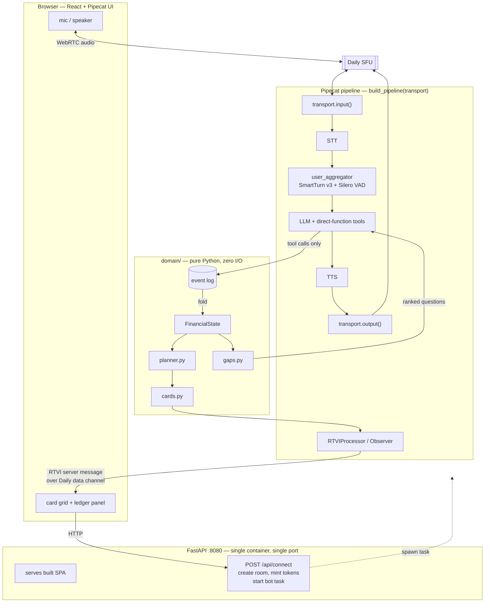

# BUILD PLAN — FinVoice

Read `SPEC.md` for the brief. This file is what we build and in what order.

---

## 1. The thesis

**The LLM never does arithmetic. It extracts facts and narrates results. A pure
deterministic planner owns every number.**

The model's only numeric surface is a set of tools that write typed facts into an event
log. It is instructed — and structurally unable — to state a figure that did not come
back from a tool result.

This is not style. It is the only way to satisfy three graded requirements at once:

| Requirement (SPEC) | Why this design satisfies it |
|---|---|
| Cards stay consistent under correction (§3.3) | Cards are projections of one state object. Inconsistency is unrepresentable. |
| Calculations visible and testable (§3.4) | Planner is a pure function. Unit tests, no LLM, no network. |
| Must not invent numbers (§4.1) | Structural, not prompted. No channel exists for an unsourced figure. |

The second thesis, which follows from the first:

**Deterministic *what*, generative *how*.** The planner decides which question matters
next by measuring decision impact. The LLM decides how to phrase it. Question
*selection* is never left to a model that will loop, drift, or re-ask.

---

## 2. Architecture



**Single container.** Multi-stage Dockerfile: node builds the SPA, python image serves
`dist/` plus `/api` plus the bot. One port, one command, no second terminal.

---

## 3. Module layout

Keep it small. Every file should be explainable in one sentence in the live session.

```
finvoice/
  docker-compose.yml
  Dockerfile                 # multi-stage: node build -> python 3.12-slim
  .env.example
  README.md
  SPEC.md
  BUILD-PLAN.md
  CLAUDE.md
  DECISIONS.md               # <- YOU write this, by hand

  server/
    main.py                  # FastAPI: static, /api/connect, session registry
    config.py                # env -> frozen Config; the only clock read
    session.py               # one call = one Session; owns the log + card pushes
    bot.py                   # build_pipeline(transport, session) -> Pipeline
    eval_bot.py              # the same pipeline over the eval transport
    tools.py                 # direct functions the LLM may call
    prompt.py                # system prompt
    providers.py             # STT/TTS/LLM factory behind env switches
    domain/
      money.py               # Money = int paise. No floats, anywhere.
      speech.py              # how a date is said out loud
      events.py              # event types
      state.py               # FinancialState + the fold over the log
      planner.py             # 30-day simulation + prioritisation   <- the core
      gaps.py                # sensitivity-ranked information gaps
      cards.py               # selectors: (state, plan, gaps) -> cards

  web/
    src/
      App.tsx                # call controls + layout
      cards/                 # one component per card type
      LedgerPanel.tsx        # the day-by-day table — "show the math"
      useSession.ts          # RTVI client + onServerMessage -> card state

  evals/
    suite.yaml               # spawns a bot per scenario; one command
    judge.py                 # the judge LLM, so no key sits in a scenario
    scenarios/*.yaml         # pipecat eval run
  tests/
    test_planner.py          # deterministic, no LLM
    test_events.py           # corrections, conflicts, folds
    test_gaps.py             # ranking behaviour
    test_tools.py            # the model's API, exercised without a model
```

---

## 4. Domain design

### 4.1 Money

`Money = int`, in **paise**. Never float. Every amount enters as rupees from the LLM and
is converted at the boundary. Rounding is explicit and happens in one place.

A float bug in a financial planner is the single most embarrassing failure available
here, and "why integers?" is a gift of a live-session question.

### 4.2 Events — the log is the source of truth

```
FactRecorded(fact_id, kind, label, amount, day, certainty, verbatim, turn)
FactCorrected(fact_id, amount?, day?, verbatim, turn)
FactRetracted(fact_id, reason)
ConflictFlagged(conflict_id, fact_ids, note)
ConflictResolved(conflict_id, chosen_fact_id)
```

`kind` ∈ `income | loan_emi | credit_card | essential | optional | cash_on_hand`

`certainty` ∈ `stated | estimated(low, high) | unknown`

**Corrections append, never mutate.** Current state is a fold over the log. This gives
the correction requirement by construction, plus an audit trail the UI can render —
"18,000 (corrected from 15,000)" is a strong demo beat and visible proof the ripple is
real.

### 4.3 Planner — pure function

`plan(state: FinancialState, as_of: date) -> PlanOutcome`

1. Build a 30-day timeline from `as_of`. Place every inflow and outflow on its day.
2. Walk day by day, carrying a running balance from `cash_on_hand`.
3. Record every day the balance goes negative, and by how much.
4. If shortfall, apply the priority ladder (below) and re-simulate.
5. Return `Feasible | Tight | Infeasible` — **`Infeasible` is a first-class return
   type**, not a branch, so the UI is forced to render it. SPEC §3.4 requires saying
   plainly when the money does not stretch.

**Date-awareness is the whole point.** Income on the 25th does not rescue a bill due on
the 10th. A monthly-total model gets this wrong and looks fine doing it; a day-by-day
walk catches it. This is where most naive submissions fail.

### 4.4 Priority ladder

Explicit, ordered, documented, unit-tested:

1. **Essentials** — food, rent, utilities, transport to work. Survival first.
2. **Secured obligations** — home/vehicle EMI. Missing these risks the asset.
3. **Revolving minimums** — credit-card minimum due. Stops penalty and compounding.
4. **Remaining obligations** by cost of delay, descending.
5. **Optional expenses** — cut last-in, largest-first.

**Cost of delay** = `late_fee + (apr / 365 * balance * days_late)`.

If APR is unknown the planner uses a documented conservative default **and labels it as
an assumption in the output**. It never silently guesses. That is SPEC §3.2 "avoid
presenting guesses as facts" made mechanical.

**Why this order, and why all-or-nothing.** Mainstream debt guidance agrees on the top
of the ladder: pay what keeps a roof, the lights on and food on the table first, then
secured debts — especially a vehicle needed for work, since losing it costs the income
that services everything else. Cards sit above the unsecured loan because missing a card
minimum starts revolving interest on the *whole outstanding balance* at 36–48% a year,
the most expensive money an Indian household can be charged; a missed instalment carries
a late fee and penal interest on that instalment alone.

UK debt-advice practice would split what is available across non-priority creditors
**pro-rata** instead. We deliberately do not: pro-rata belongs to negotiating arrears
under an agreed plan, whereas here the contractual amounts are still due, so a part
payment is still a missed payment — and proposing arrangements is exactly what SPEC §4.3
forbids this assistant from inventing.

**The one exception is not ours to propose.** The plan can say what is left over and
suggest the user ask their lender what, if anything, would be accepted. If they come back
with an answer, it enters the log as `ArrangementConfirmed` and the planner honours it —
reducing that payment to the agreed figure before giving it up entirely, and never
reducing it at all while the month clears without doing so. The amount owed is untouched,
so the card still shows what remains outstanding. The assistant never proposes the
arrangement, never suggests a figure, and never says it has contacted anyone: the lender's
answer reaches the plan only through the user.

**Known weakness.** `cost_of_delay` computes card penalties on the *minimum*, because the
card's outstanding balance is not a fact we collect. It therefore understates card risk —
measured on the §4.7 fixture it ranks the personal loan as the most expensive thing to
delay, the opposite of the ladder's claim. The tier ordering, not the arithmetic, is what
protects the cards; `cost_of_delay` only breaks ties *within* a tier.

### 4.5 Gap ranking — the stopping criterion

For each `unknown` or `estimated` fact, re-run the planner at its low and high bound.
Compare outcomes:

- Feasibility classification flips → **high impact, ask immediately**
- Shortfall magnitude moves materially → medium
- Only action ordering changes → low
- Nothing changes → **impact zero, do not ask**

The LLM receives the top-ranked gaps as context each turn and chooses phrasing. When no
remaining gap changes the outcome, information gathering is done.

This answers three things at once: "avoid a fixed questionnaire" (§3.2), "knowing when
enough information has been collected" (Track A), and the live-session prompt about
statistical methodology. Uncertainty is carried as **intervals**, not distributions —
simple interval arithmetic is explainable under questioning in a way Monte Carlo is not.

### 4.6 Cards

Pure selectors over `(state, plan)`, each with a monotonic `revision`. Pushed on every
state change via RTVI server message.

| Card | Shows |
|---|---|
| `cash_position` | Money on hand today |
| `income` | Each source, amount, expected day, certainty badge |
| `obligations` | Loans + credit cards, due days, minimums |
| `essentials` | Non-negotiable outgoings |
| `optionals` | Candidates for cutting |
| `calendar` | 30-day strip, inflow/outflow markers, negative days in red |
| `bottom_line` | Shortfall or surplus, with the date it first bites |
| `missing_info` | Open gaps, ranked — visible proof of what is not known |
| `actions` | Ordered proposed actions, each with date, amount, reason |
| `ledger` | **Day-by-day table. The reviewer checks our arithmetic by eye.** |

The `ledger` card is the direct answer to "calculations must be visible and testable".
Build it early; it is also the best debugging tool we will have.

### 4.7 The golden journey

One persona, built end to end. Salaried man in his thirties, one earner and a spouse
with irregular income, servicing more than he can cover this month.

| Item | Amount | Day | Kind |
|---|---:|---:|---|
| Salary | 38,000 | 1 | income, stated |
| Spouse income | 12,000 | ~10 | income, **uncertain — "sometimes late"** |
| Cash on hand | 2,200 | 0 | cash_on_hand |
| Rent | 14,000 | 5 | essential |
| Two-wheeler EMI | 4,200 | 8 | loan_emi, secured — how he gets to work |
| School fee | 15,000 | 10 | essential, annual, lands this month |
| Personal loan EMI | 9,500 | 15 | loan_emi |
| Credit card 1 minimum | 2,100 | 18 | credit_card |
| Credit card 2 minimum | 1,400 | 22 | credit_card |
| Household essentials | 11,000 | spread | essential |
| Optional | 3,000 | spread | optional |

In 52,200. Out 60,200. **Cut every optional rupee and he is still 5,000 short.**

The arc the demo must walk:

1. Messy intake — amounts arrive out of order, some vague
2. **Conflict** — states the personal loan EMI as 9,500, later says "around eight and a
   half". Agent flags it and asks, rather than picking one
3. **Correction** — an amount is revised aloud; every card moves
4. **Uncertainty that matters** — the spouse income lands the same day as the school
   fee, so its timing is the highest-ranked gap. The agent asks about the date, not the
   amount, because that is what changes the outcome
5. **Infeasible, stated plainly** — essentials, rent, two-wheeler and card minimums are
   covered; the personal-loan EMI is named as the exposure. No new loan suggested, no
   settlement invented, no claim of having contacted anyone
6. Understanding confirmed

This persona is the Phase 1 fixture set and the Phase 5 video. Two further personas —
a timing trap that is feasible on totals but broken on dates, and an uncertainty-heavy
self-employed case — are deferred; add them as fixtures once B is green.

---

## 5. Tool surface

Direct functions (Pipecat derives the schema from signature + docstring). This is the
LLM's entire numeric API.

```
record_money_fact(kind, label, amount_rupees?, day_of_month?,
                  amount_low_rupees?, amount_high_rupees?,
                  day_earliest?, day_latest?, spread?, secured?)
correct_fact(fact_id, amount_rupees?, day_of_month?)
retract_fact(fact_id, reason?)
flag_conflict(fact_ids, note)
resolve_conflict(conflict_id, chosen_fact_id)
record_lender_answer(fact_id, accepts_rupees)   # only after the user reports one
record_nothing_further(kind)                    # "none at all" / "that's all of them"
compute_plan()          -> the plan, in words, for the model to narrate
open_questions()        -> missing categories, then ranked gaps, then sweeps
```

`record_nothing_further` exists because `gaps.py` ranks by sensitivity, and sensitivity
cannot see a category nobody mentioned: an unstated rent has no fact to probe and no range
to swing, so it reads identically to a question already settled. Coverage is therefore
tracked separately.

Recording a fact is not what closes a category, though — one rent is not evidence there is
no school fee, and a plan built on that reports money left over that the user does not
have. A category is closed only when the user says it is finished, which is the same
answer whether they have none at all or none beyond what is recorded. So one event covers
both, and remembering one later reopens the category.

Each category also carries what to **anchor** the question on, handed to the model in
`open_questions` as `anchor_on`. Nobody can answer "what is your essential spending";
anyone can say where they live and how they get to work, and the spending falls out of the
answer. The anchor is a noun phrase naming the concrete thing to ask about — never a
sentence to read aloud. Which question to ask stays deterministic; how to say it stays the
model's.

Note what is absent: nothing that computes. `compute_plan` returns a computed result; it
does not accept one.

**Nothing comes back as digits either.** Every amount leaves a tool as words — "nine
thousand five hundred rupees" — so there is no figure in the model's context to round,
restate or quietly adjust, and what it reads aloud is what the planner worked out. Digits
go to the cards, which the browser renders and never totals. That makes the first rule
structural rather than prompted: a tool result the model could do arithmetic on does not
exist. The exception is the user's own words — a label like "Credit card 2" comes back as
they said it.

Three departures from the first draft of this list, each because Phase 1 settled the
question differently:

- **`certainty` is not an argument.** It is derived in `events.py` from whether bounds are
  present, so a tool that accepted it could contradict the data beside it. The model
  supplies the range it heard and the certainty follows.
- **`mark_unknown` is gone.** `record_money_fact` with no `amount_rupees` *is* an unknown,
  and `gaps.py` already ranks it. One tool with one meaning beats two the model has to
  choose between.
- **`retract_fact` is new.** "Forget the gym, I cancelled it" is an ordinary thing to say,
  `FactRetracted` already existed, and without a tool it was unreachable code.

All handlers are in-memory Python — an append to a list, and a 30-day loop over a few
dozen items. Sub-millisecond. Because tool calls are effectively free, the agent
recomputes the plan on **every** turn, which is what makes cards feel live rather than
batched. Wire `on_function_calls_started` to a filler utterance anyway, for the one slow
path.

---

## 6. Phases

Ordered by dependency and by what survives a crunch. Phases 1–2 are load-bearing: a
correct planner with a text-mode transcript is a far better submission than half-working
audio over an empty core.

### Phase 0 — Skeleton
Repo, `uv` project on Python 3.12, pinned `pipecat-ai==1.10.0`, Dockerfile, compose,
`.env.example`, FastAPI serving a placeholder page on :8080.
**Exit:** `docker compose up --build` serves a page.

### Phase 1 — Domain + tests (no voice, no LLM)
`money`, `events`, `state`, `planner`, `gaps`, `cards`. Unit tests built from the §4.7
fixture, including the infeasible outcome and the conflict.
**Exit:** `pytest` green; the fixture produces a plan you can check by hand.

### Phase 2 — Agent in text mode
`build_pipeline(transport, session)`, tools, prompt. Run under Pipecat's **eval
transport** — text in, text out, TTS skipped and no audio synthesised, seconds per run.

```bash
uv run python -m pipecat.evals suite evals/suite.yaml
```

`python -m`, not the `pipecat` script: the scenarios' judge is `evals.judge`, in this
repo, and only `-m` puts the working directory on the import path.

**Exit:** a full typed conversation records facts, handles a correction, and produces a
plan. This is where prompt iteration happens; do not move on until it is solid.

### Phase 3 — Voice
Swap in `DailyTransport`. Smart Turn v3 + Silero VAD on the user aggregator. Room and
token minting in `/api/connect`. Bot as an asyncio task per session.
**Exit:** speak to it, hear it, interrupt it.

### Phase 4 — Cards UI
RTVI server messages → React state. Pipecat UI components for call controls; hand-built
cards. Ledger panel. Correction highlighting.
**Exit:** correct an amount aloud, watch every card move.

### Phase 5 — The golden journey
The persona and arc in §4.7, end to end. README, `.env.example`, demo video, the
what-works/what-doesn't list.
**Exit:** submittable.

### Phase 6 — Optional track
Decide A or B **after** Phase 5. Track B is cheaper given Pipecat Evals is already
wired; Track A is partly satisfied for free by gap ranking and Smart Turn. Open
decision, per SPEC §11.

---

## 7. Environment variables

```
PORT=8080

DAILY_API_KEY=            # required. server-side only, never sent to browser

LLM_PROVIDER=openai       # openai | google — see SPEC §11, decision open
STT_PROVIDER=deepgram
TTS_PROVIDER=cartesia

LLM_MODEL=                # blank takes the selected provider's default
GEMINI_THINKING_LEVEL=low       # 3.8-flash and 3.7-flash reject 'minimal'

OPENAI_API_KEY=
GOOGLE_API_KEY=
DEEPGRAM_API_KEY=
CARTESIA_API_KEY=

TURN_DETECTION=smart      # smart | vad
VAD_STOP_SECS=0.8         # only used when TURN_DETECTION=vad
```

`providers.py` is a factory behind these switches. Provider choice is deliberately
deferred (SPEC §11.A); the seam is what makes deferring safe, and adding Gemini proved
it — one branch in `make_llm`, with `bot.py` and the pipeline untouched.

**`LLM_MODEL` has no single default.** It resolves against the provider actually selected,
because one shared default means choosing Gemini and forgetting the model sends an OpenAI
model name to Google, and that fails at the first turn rather than at startup.

**The eval judge follows `LLM_PROVIDER` and not `LLM_MODEL`.** One switch moves the bot and
its examiner together, so a run can never be graded by a provider there is no credit for;
but the yardstick stays on its provider's default, because a measure that moves whenever
the thing being measured is tuned is not a measure. Judging a model with its own family
shares blind spots — acceptable only because every criterion in `evals/scenarios/` asks
about something observable (did it state a figure, did it claim to have contacted a
lender) rather than about subtle quality. The one thing no judge is trusted with is the
arithmetic: `numbers_come_from_the_planner` pins the figures with `text_contains`, so
whether the assistant said "seven thousand rupees" is settled by a substring and not by
an opinion.

### 7.1 What each default costs

**Speech providers trade accounts against latency.** Cartesia is the default because time
to first byte is under 100ms and a voice call has about a second to work with. Pointing
both speech seams at OpenAI drops the system to two accounts — `DAILY_API_KEY` and
`OPENAI_API_KEY` — for roughly 200–400ms more per reply, which is a large share of that
budget. `TTS_PROVIDER=deepgram` is the middle option and the one to reach for when a
Cartesia key runs dry: `DEEPGRAM_API_KEY` then covers both seams, and the failure it fixes
is a call that connects and never speaks.

**`GEMINI_THINKING_LEVEL` is pinned for the same reason `VAD_STOP_SECS` is** — the default
is wrong for this workload. Gemini 3 models think before answering; those tokens cost
latency on a live call and bill at the output rate. Keep it as low as the model accepts:
`gemini-3.8-flash` and `gemini-3.7-flash` both reject `minimal` with a 400 on the first
turn, and Pipecat 1.10.0 only knows to clamp 3.7 — so it will forward a level the model
refuses and the call dies mid-conversation rather than at startup.

**Google keys have to be made in AI Studio.** Google now rejects unrestricted standard keys
and blocks dormant ones; keys created in AI Studio today are auth keys and work. A key in
either bad state is tagged in the console, which is the only place it is visible — from
this side it is an auth failure at the first turn.

**Pipecat's deferred imports have to be warmed at startup.** It defers a large set of
imports and warms them inside pipeline setup, on a worker thread, against a twenty-second
budget shared with joining Daily and opening two speech sockets. The first call in a fresh
process loses that race; every call after it sets up in about a millisecond, because the
modules are then in `sys.modules`. `lifespan` pays it once, where nothing is waiting.

---

## 8. Known risks

| Risk | Mitigation |
|---|---|
| Pipecat 1.x API churn | Pin `1.10.0` exactly. Verify against that version's examples, never memory. |
| Smart Turn model download at runtime | **Bake the ONNX model into the image at build time.** A reviewer on a slow link must not wait. |
| `getUserMedia` needs a secure context | `localhost` qualifies. Never test via LAN IP. |
| Zombie Daily participants | Handle `on_participant_left` / `on_client_disconnected`; cancel the worker. Short room + token `exp`. |
| Keys visible in debug logs | Pipecat is chatty. Check log level before recording the video. |
| Speaker bleed during dev | Use headphones or barge-in behaves erratically and you debug AEC that is not broken. |
| STT mishearing lakh/crore | Read amounts back to the user. Confirmation is a correctness mechanism, not politeness. |

---

## 9. Definition of done

- [ ] `docker compose up --build` → working app at the README address, no second terminal
- [ ] Voice conversation start to finish, interruptible
- [ ] Cards update live and survive a spoken correction
- [ ] Ledger panel shows arithmetic a reviewer can verify by hand
- [ ] Infeasible case explained honestly, no invented escape route
- [ ] `pytest` green; planner tested independent of any LLM
- [ ] `.env.example` complete; no secrets committed
- [ ] README: variables, which are required, how to supply keys, exact command, exact address
- [ ] Demo video
- [ ] `DECISIONS.md` handwritten, entries timestamped through the build
- [ ] What works / what doesn't / what's next / where AI helped / where AI was wrong
