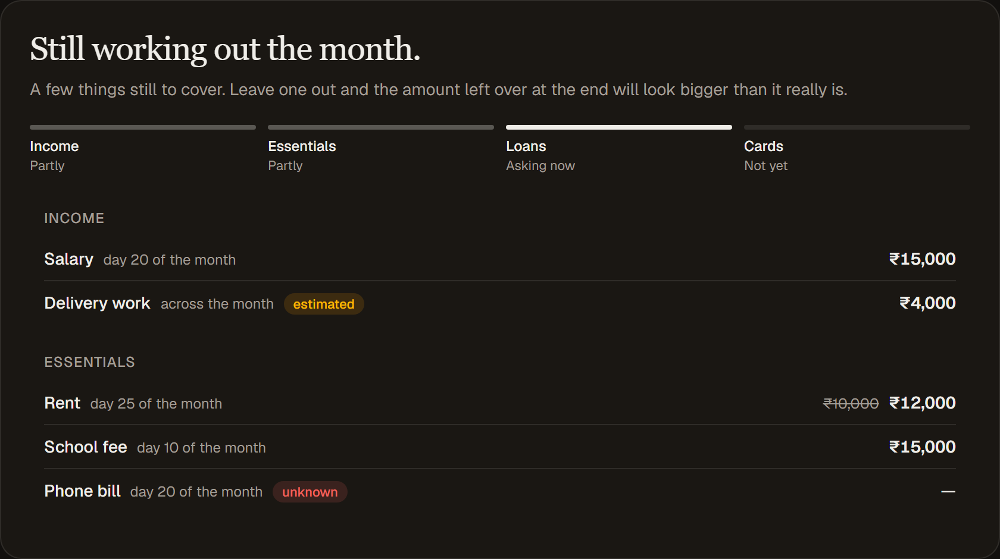
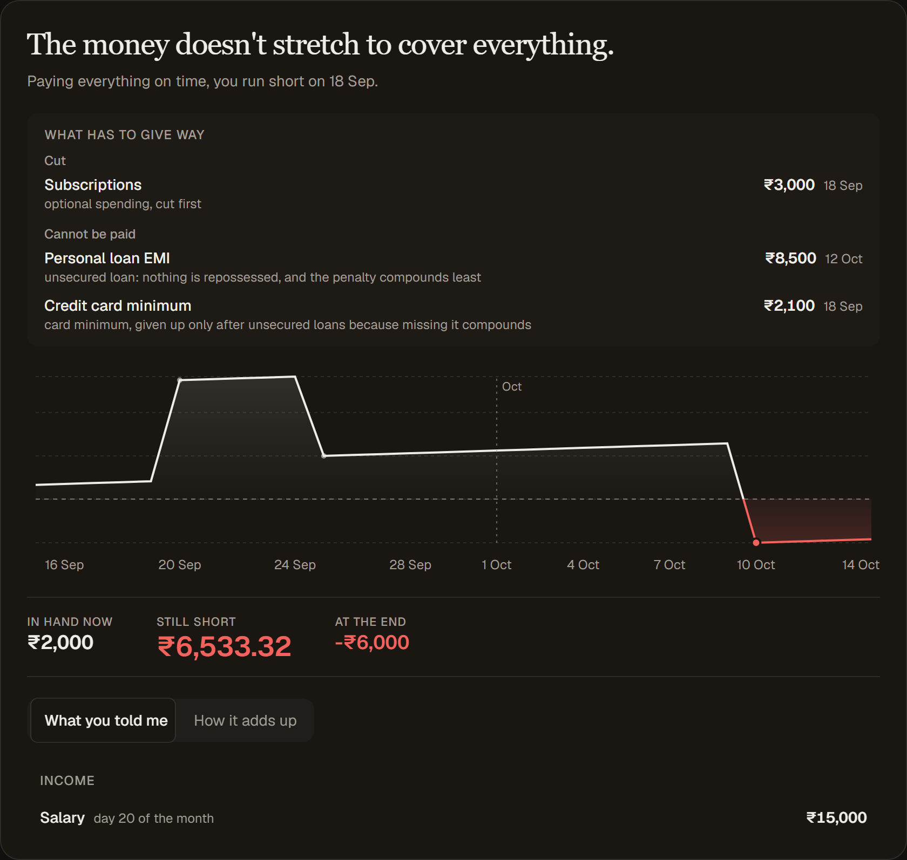
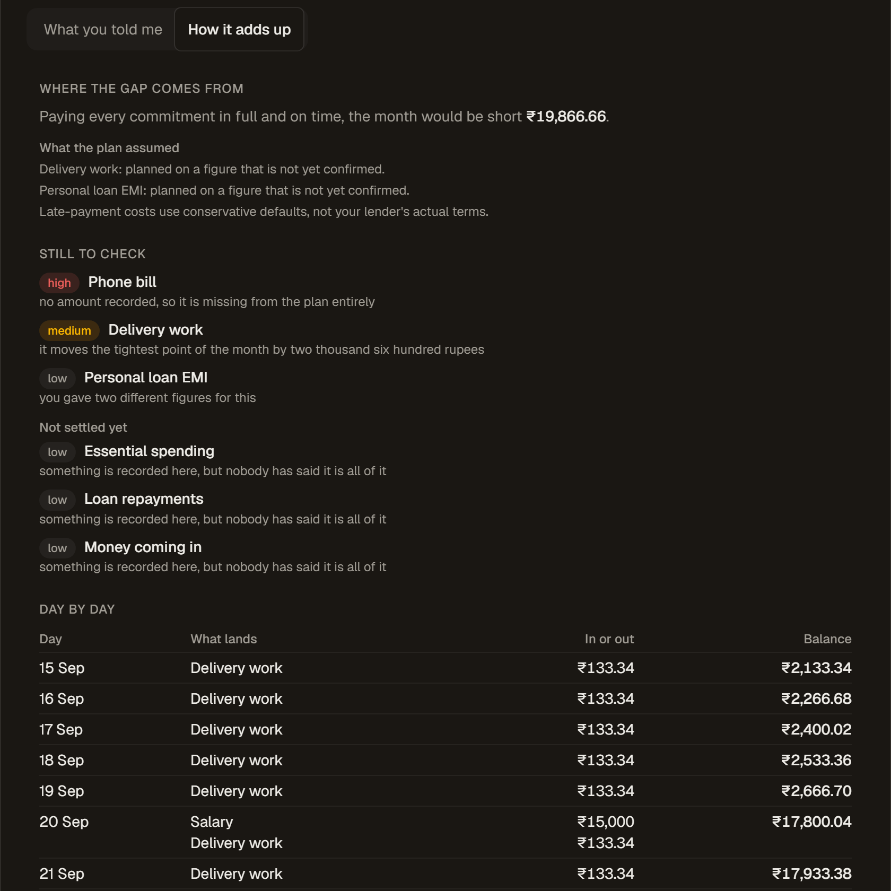

# FinVoice

A real-time voice assistant for planning the next 30 days of personal finances — multiple
loans, income landing on different dates, and usually less money than the month demands.

You talk; it asks what comes in and what has to go out, reads every figure back to you, and
works out whether the month holds. When it doesn't, it says which payment gives way and why.
Everything appears on screen as you speak, so you can check it while you talk.

Built on [Pipecat](https://pipecat.ai) and [Daily](https://daily.co).

---

## Run it

Four keys: [Daily](https://dashboard.daily.co/developers),
[OpenAI](https://platform.openai.com/api-keys), [Deepgram](https://console.deepgram.com/),
and [Cartesia](https://play.cartesia.ai/keys). Fewer if you change providers — see
[Configuration](#configuration).

```bash
cp .env.example .env      # paste the four keys in
docker compose up --build
```

The first build takes a few minutes: it installs the Python tree, builds the frontend, and
bakes in the Smart Turn model so no call waits on a download.

Then open <http://localhost:8080>, press **Connect**, and allow the microphone.


If the call won't start, <http://localhost:8080/api/health> says why: `status` is `ok`, or
`needs-config` with `missing_env` and `misconfigured` naming exactly what to fix. The server
starts without keys on purpose and refuses calls with a 503, rather than failing after you
have already joined a room.

---

## What you just saw

The screen has two shapes, and it switches on how much of the month has actually been
covered — not on a timer.

**While it is still asking**, there is no plan on screen, because a plan built on a quarter
of the facts is not a plan. You get a coverage strip — Income, Essentials, Loans, Cards — showing
what has been settled and what has not been raised yet, and underneath it every figure you
have given, grouped. That list is the read-back made visible: speech recognition confuses
fifteen and fifty, and a figure you cannot see is one you cannot correct.



**Once every category is closed**, it becomes a plan: the verdict in one line — *the month
works*, *it works but only just*, or *the money doesn't stretch to cover everything* — then
what has to give way, the running balance across the thirty days with the zero line drawn,
and the figures. Two tabs sit under it: **What you told me**, and **How it adds up**, which
holds the day-by-day ledger every number was built from.



Correct something mid-sentence and every figure that depends on it moves.

---

## How it works

**The language model never does arithmetic.**

It extracts facts from the conversation through tool calls, and a pure Python planner in
`server/domain/` computes every number. The model narrates results; it does not produce
them. The frontend renders what the server sent and never recomputes anything.

That is why a correction propagates cleanly — the cards are projections of one state object,
so an inconsistent screen is unrepresentable rather than merely unlikely — and it is why the
planner is tested with no LLM in the loop. The ledger is on screen for the same reason: the
claim that no figure was invented is worth nothing if the derivation is hidden.



`SPEC.md` states the requirements. `BUILD-PLAN.md` covers the architecture, the provider
seam, and why each default is what it is.

---

## Configuration

Every seam is an env var. Unrecognised provider names, a reasoning level the model refuses,
and a `TURN_DETECTION` that is neither `smart` nor `vad` are all caught at startup, reported
on `/api/health`, and refused before a room is minted — never on the first turn, after you
have joined.

### Keys

`GET /api/health` names exactly what is missing for the combination you chose.

| Variable | Used for | Needed when | Source |
|---|---|---|---|
| `DAILY_API_KEY` | WebRTC transport. Server-side only; never reaches the browser. | always | [dashboard.daily.co](https://dashboard.daily.co/developers) |
| `OPENAI_API_KEY` | The model, and OpenAI's STT or TTS. | any seam points at `openai` *(the model does, by default)* | [platform.openai.com](https://platform.openai.com/api-keys) |
| `DEEPGRAM_API_KEY` | Speech-to-text, and text-to-speech on Aura 2. One key covers both. | `STT_PROVIDER` or `TTS_PROVIDER` is `deepgram` *(STT is, by default)* | [console.deepgram.com](https://console.deepgram.com/) |
| `CARTESIA_API_KEY` | Text-to-speech. | `TTS_PROVIDER=cartesia` *(the default)* | [play.cartesia.ai/keys](https://play.cartesia.ai/keys) |
| `GOOGLE_API_KEY` | The model, on Gemini. Create it fresh in AI Studio — Google rejects unrestricted and dormant keys. | `LLM_PROVIDER=google` | [aistudio.google.com](https://aistudio.google.com/apikey) |

To drop to **three** accounts, set `TTS_PROVIDER=deepgram` — one key then covers both speech
seams. To drop to **two**, set `STT_PROVIDER=openai` and `TTS_PROVIDER=openai`, leaving only
Daily and OpenAI. That last one costs roughly 200–400ms per reply against Cartesia's
sub-100ms time to first byte, which is a large share of the second a voice call has to work
with.

### Options

| Variable | Default | Notes |
|---|---|---|
| `LLM_PROVIDER` | `openai` | `openai` or `google` |
| `LLM_MODEL` | per provider | Blank picks the provider's default: `gpt-5.6-luna`, or `gemini-3.8-flash` |
| `STT_PROVIDER` | `deepgram` | `deepgram` or `openai` |
| `TTS_PROVIDER` | `cartesia` | `cartesia`, `deepgram` (`aura-2-helena-en`), or `openai` |
| `OPENAI_REASONING_EFFORT` | `none` | OpenAI only — see below |
| `GEMINI_THINKING_LEVEL` | `low` | Gemini only. `low`/`medium`/`high`. `gemini-3.8-flash` rejects `minimal`, which older Gemini accepted |
| `TURN_DETECTION` | `smart` | `smart` = Smart Turn v3 semantic end-of-turn; `vad` = fixed silence threshold |
| `VAD_STOP_SECS` | `0.8` | Only read when `TURN_DETECTION=vad`. Users pause mid-sentence recalling numbers, so this sits well above Pipecat's default |
| `AS_OF` | today, in India | ISO date the 30 days run from, so a run is reproducible. `AS_OF=2026-09-15` plans 15 Sep – 14 Oct |
| `LOG_LEVEL` | `INFO` | Pipecat's debug output is chatty enough to print key material |
| `PORT` | `8080` | |

`OPENAI_REASONING_EFFORT` is not a latency dial. `gpt-5.6-luna` documents six levels, but
accepts function tools on `/v1/chat/completions` at `none` and nothing else — and every turn
here carries tools, so `none` is the only value that works. It is also the fast one.

---

## Development

`daily-python` ships no Windows wheels, so the backend needs Linux or macOS. On Windows use
Docker or WSL; dependency resolution fails outright on a Windows host, before anything runs.

Instead of Docker, to get hot reload on the frontend — the API and the SPA, in two terminals:

```bash
uv sync --group dev
uv run python -m server.main            # API on :8080
```

```bash
cd web && npm install && npm run dev    # SPA on :5173, proxying /api to :8080
```

Stop the container first, or :8080 is already taken.

```bash
uv run pytest -q
uv run ruff check .
```

Tests are not in the container image, and the runtime environment is built without dev
dependencies.

### Behavioural evals

`tests/` is deterministic and needs no model. How the agent *behaves* is checked separately,
by driving the real pipeline as text over Pipecat's eval transport — same prompt, same tools,
no microphone and nothing synthesised. `evals/RESULTS.md` records what the suites have found.

```bash
uv run python -m pipecat.evals suite evals/suite.yaml            # window opens on the 1st
uv run python -m pipecat.evals suite evals/suite-midmonth.yaml   # window straddles two months
```

Use `python -m`, not the `pipecat` script: the judge lives in this repo at `evals/judge.py`,
and only `-m` puts the working directory on the import path.

To iterate on one scenario against a bot you keep running:

```bash
uv run python -m server.eval_bot --port 7860 --as-of 2026-09-01
uv run python -m pipecat.evals run evals/scenarios/the_month_does_not_work.yaml -v
```

Both the bot and the judge call a paid API. A suite run is roughly 82k input and 11k output
tokens. The judge follows `LLM_PROVIDER`: on OpenAI it is the bot's own model with reasoning
off; on Gemini it is `gemini-3.5-flash-lite` — see `evals/judge.py` for why each.

---

## Layout

```
server/          FastAPI app, Pipecat pipeline, provider seam
  domain/        pure planning logic — no I/O, no network, no clock
web/             React + Vite frontend
tests/           deterministic tests for the domain and wiring
evals/           scenario-based behavioural evals
```
